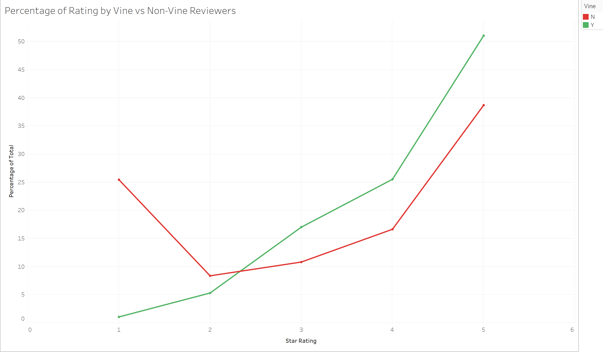

# Amazon_Vine_Analysis

## Project Overview
In this project we will extract a dataset containing reviews from an AWS S3 data bucket and transform the data using PySpark.  We will then connect to an AWS RDS instance and load the transformed data into pgAdmin.  Finally, we will use the transformed data to determine if there is any bias towards favorable reviews from paid members of Amazon’s Vine program.

### Purpose
The Amazon Vine program is a service that allows manufacturers and publishers to receive reviews for their products.  Our client, SellBy, is considering joining the service and having their products reviewed by Amazon Vine members.  Before joining the program, SellBy wants to determine if the reviews from the Vine program are reliable or if they are biased in any direction.  Our project will help determine the reliability of Vine reviews.

## Results
After narrowing down the reviews dataset to only include reviews with 20 or more votes and at least half of those votes being helpful we had 40,565 reviews left.  The breakdown of those reviews is:
-	94 Vine reviews
-	48 5-star Vine reviews
-	51.06% of Vine reviews received 5 stars.
-	40,471 non-Vine reviews
-	15,663 5-star non-Vine reviews
-	38.7% of non-Vine reviews received 5 stars.

## Summary
The results of our analysis show that there is a somewhat significant bias towards positive reviews from the paid members of Amazon’s Vine program.  Reviews from members of the Vine program receive 5 stars a little over half the time while reviews not part of the program only receive 5-star reviews 38.7% of the time.  That is more than a 12% difference, showing that receiving payment may inadvertently push reviewers to give more positive reviews.

An analysis of the distribution of Vine and non-Vine reviews from 0 to 5 stars, like the following chart, would be helpful.  Reviews that are left by non-Vine members are because they had an opinion on a product and wanted to honestly express that opinion to other potential buyers without compensation.  However, reviews by Vine members may be done simply to get it done because they are receiving payment for it.  Because of this, Vine members may put 5 stars simply because it is the simplest way to get the review done.  I would be curious to see if Vine reviews have a general trend towards higher reviews versus non-Vine reviews, or if 5-stars are the only anomaly due to Vine reviewers doing the minimum to get paid.

